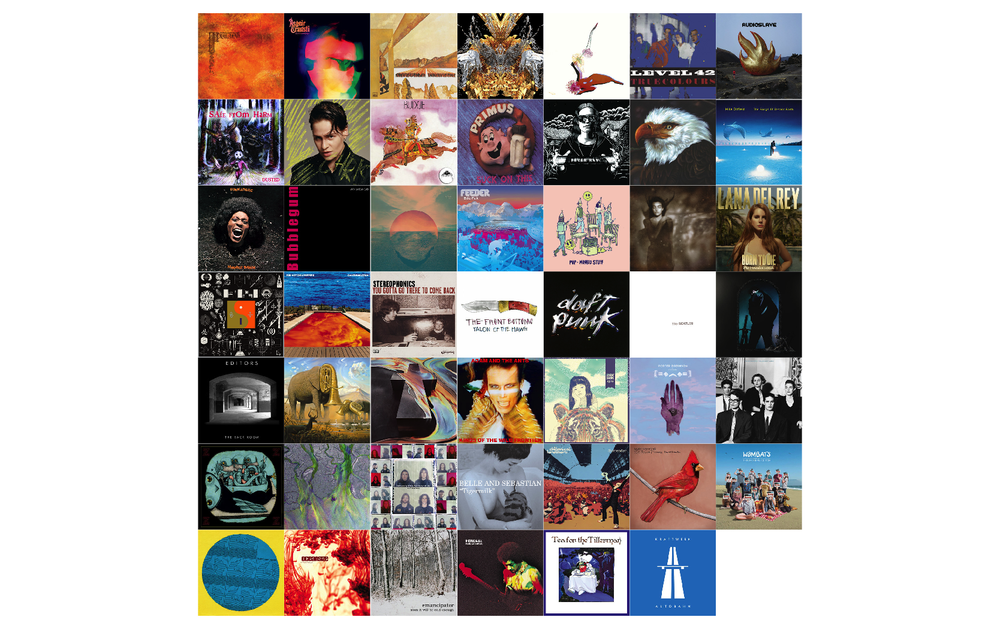

# Spotify Artwork

## Get album artwork for a vector of given Spotify album IDs

1. [Configure your application](https://developer.spotify.com/documentation/web-api/). [Help on authorisation](https://developer.spotify.com/documentation/general/guides/authorization-guide/).

2. Create a list of Spotify album IDs in a column called `album_id`, save as .tsv in the data folder.