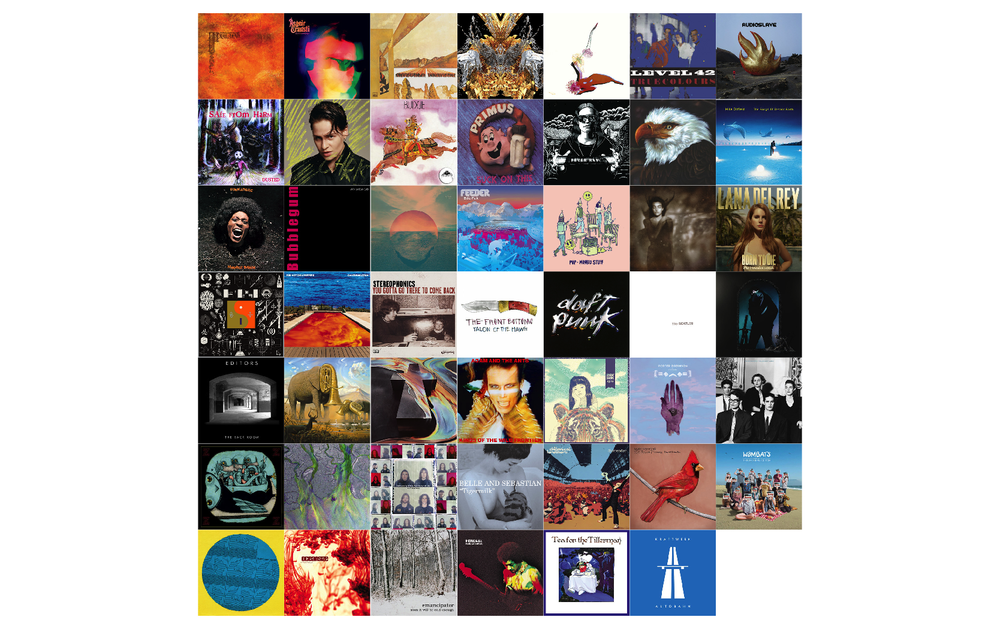

# Spotify Artwork v0.1

## Get album artwork for a vector of given Spotify album IDs

1. [Configure your application](https://developer.spotify.com/documentation/web-api/). [Help on authorisation](https://developer.spotify.com/documentation/general/guides/authorization-guide/). Use the generated secrets to populate the required fields within the `credentials.toml`. See `docs/example_credentials.toml` for guidance.

2. Create a list of Spotify album IDs in a column called `album_id`, save as .tsv in the data folder.

3. Run the scripts from the project file.

Many thanks to [Charlie86](https://github.com/charlie86/spotifyr) 's excellent 'spotifyr' web api client for making this process much less painful.

Also [thomasp85](https://github.com/thomasp85/patchwork)'s excellent 'patchwork' package for wrapping the artwork together very easily.

Last but not least, [ropensci](https://github.com/ropensci/magick)'s 'magick' package for simple image manipulation.
